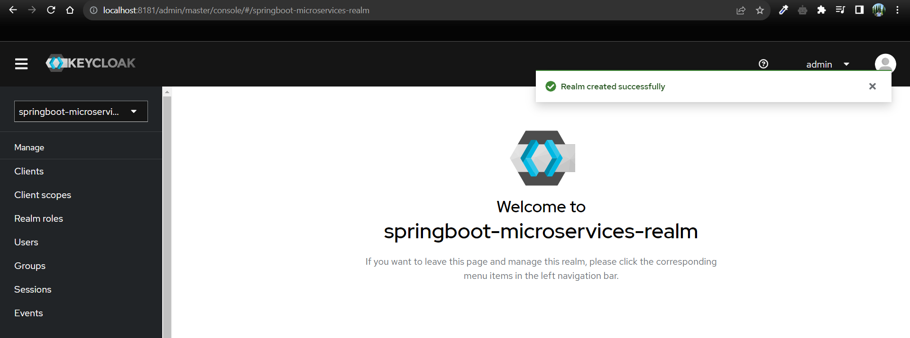

Readme file for complete microservices modules.

**Modules**
API-Gateway
Product-Service
Order-Service
Inventory-Service
Discovery-Server

**Keycloak Docker URL** 
Command: docker run -p 8080:8080 -e KEYCLOAK_ADMIN=admin -e KEYCLOAK_ADMIN_PASSWORD=admin quay.io/keycloak/keycloak:22.0.1 start-dev

**Create realm**

